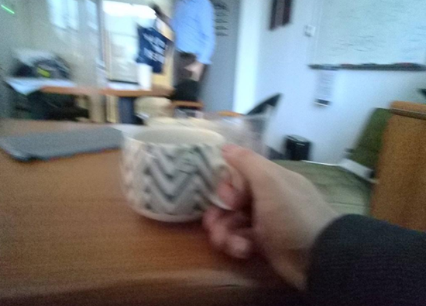

# Ứng dụng hỗ trợ dán nhãn Egocentric Action Recognition cho tập dữ liệu Lifelog

## Giới thiệu

**Lifelog**: Hành động thu thập, ghi chép dữ liệu về cuộc sống hằng ngày của bản thân. Trong ngữ cảnh của ứng dụng này, dữ liệu lifelog là dữ liệu hình ảnh được thu thập từ wearable camera.

**Egocentric Action Recognition**: Dự đoán hành động được thực hiện bởi người dùng, từ hình ảnh được chụp từ góc nhìn của họ.

---

## Dataset
- Được thu thập từ một giáo sư người Ireland trong thời gian từ 01/2019 - 06/2020.
- Gồm dữ liệu ảnh của ~530 ngày, mỗi ngày khoảng 1000-2000 hình ảnh.
- Tổng số lượng ảnh: ~725k.
- Kích thước bộ dữ liệu: ~10GB (đã downscale).
- **Link dataset**: link riêng tư, liên hệ chủ project để tải về.

### Cấu trúc thư mục ảnh:

```
201901/
  01/
    20190101_103717_000.jpg
    20190101_103749_000.jpg
    *.jpg
    ...
  02/
  03/
  ...
  31/
201902/
201903/
...
202006/
```

---

## Hướng dẫn cài đặt
0. Tải toàn bộ ảnh và các file CSV về máy (Liên hệ chủ repo lấy link).
1. `git clone https://github.com/khanghdc98/annotation_app.git`
2. `git checkout verify-app`
3. `cd image-review-app`
4. Tạo file .env trong thư mục image-review-app:
  ```
  IMAGE_DIR="E:/LSCDATA/keyframes" # (thư mục chứa toàn bộ ảnh)
  OUTPUT_DIR="E:/LSCDATA/golden_corpus/ver2" # (thư mục chứa output)
  TEMP_DIR="E:/LSCDATA/golden_corpus/ver2/temp" # (thư mục tạm trong folder output)
  ORIGIN_GOLDEN_CORPUS="E:/LSCDATA/golden_corpus/ver1" # optional
  ```
5. `pip install -r requirements.txt`
6. `py gui.py`
7. Chọn SELECT CSV. Chọn tiếp vào file CSV được phân công

---

## Mô tả
- Sau khi load CSV thành công, các bạn sẽ thấy câu hỏi `Is <tên label> the main activity of this image?`. Các bạn chỉ cần check bằng cách bấm `APPROVE` (hotkey: phím A) hoặc `DECLINE` (hotkey: phím D).
- Nếu muốn quay lại record trước đó thì bấm nút `BACK` và check lại (A hoặc D). Sau đó A hoặc D tiếp từ ảnh đó trở về sau. **(Nên tắt TELEX để dễ thao tác)**
- Trong một số trường hợp khó label, các bạn có thể bấm `LOAD NEIGHBORS` để hiển thị các ảnh đứng trước (khung bên trái) và ảnh đứng sau (khung bên phải) của ảnh đang check. Thứ tự ảnh từ trái qua phải, từ trên xuống dưới.


### Một số quy tắc:
- Theo dòng thời gian, hành động A đang diễn ra lâu dài, liên tục thì hành động B xuất hiện trong một giai đoạn ngắn, song song với giai đoạn A => Chỉ ghi nhận main action là hành động B.
  - **Ảnh chỉ có A**: A là **main action**.
  - **Ảnh có cả A (lâu dài) và B (xen ngang)**: B là **main action**, A là **concurrent action**.
  - **Ví dụ**:
  <div style="display: flex; justify-content: center;">
    
    
    
  </div>    
  
  | Hình ảnh | Main Action | Concurrent Action |
  | --- | --- | --- |
  | Ảnh 1	| attending a presentation | |
  | Ảnh 2 | using computer | attending a presentation |
  | Ảnh 3	| attending a presentation | |
    
---
### Một số ví dụ
| Image                                                                                 | Label                                 | Image                                                 | Label                                          |
|---------------------------------------------------------------------------------------|---------------------------------------|-------------------------------------------------------|------------------------------------------------|
|                                     | "attending a meeting",                |                  | "playing music instruments",                   |
|                                  |     "attending a presentation",       |            |     "preparing some food",                     |
|                                               |     "cleaning kitchenware",           |               |     "reading documents",                       |
|                                              |     "doing office work",              |   |     "riding a bike or motorbike",              |
|                                              |     "doing the cleaning",             |              |     "shopping",                                |
|                                              |     "doing the laundry",              |  |     "taking a bus",                            |
|                                              |     "driving",                        |          |     "taking a photo",                          |
|                                             |     "eating",                         |                 |     "taking a plane",                          |
|                                          |     "fixing something",               |             |     "taking a train",                          |
|  |     "grooming",                       |  |     "taking out the trash",                    |
|                                             |     "having a casual conversation",   |  |     "using a computer",                        |
|                                             |     "having a drink",                 |           |     "using a mobile device",                   |
|                                             |     "lying",                          |              |     "walking indoor",                          |
|                                         |     "making financial transactions",  |        |     "walking outdoor",                         |
|                                             |     "NO ACTIVITY",                    |             |     "watching tv or digital display devices",  |
| |     "organizing clothes",             |             |     "writing"                                  |
|   | "personal hygiene",  |                                                       |                                                |


---

### Một số trường hợp đặc biệt
| Case | Hình ảnh | Main Label | Giải thích |
|---|---|---|---|
| 0a. Di chuyển trong nhà, di chuyển liên tục (nhận diện qua việc xem các ảnh liên tiếp) |  | walking indoor  | |
| 0b. Trong nhà, đứng/ngồi lâu một chỗ (không phải lying) |  | NO ACTIVITY | |
| 1a. Giơ điện thoại lên chụp hình |  | taking a photo | |       
| 1b. Có điện thoại trong ảnh nhưng không chụp hình |  | using mobile device  | |
| 2a. Ngồi ăn với 1 người nào đó (**không nhìn thấy đồ ăn** nhưng biết là đang ngồi ở quán ăn) | | having a conversation | không phải eating |
| 2b. Ngồi ăn với 1 người nào đó, thấy đồ ăn nhưng người đối diện đang mở miệng ra nói chuyện hoặc bản thân có gesture giao tiếp |  | having a conversation | không phải eating |
| 2c. Ngồi ăn với 1 người nào đó **(nhìn thấy bàn đồ ăn)** |  | eating |
| 2d. Ngồi uống với 1 người nào đó, thấy đồ uống nhưng người đối diện đang mở miệng ra nói chuyện |  | having a conversation | không phải drinking  |
| 2e. Trên bàn vừa có đồ ăn, đồ uống nhưng không thấy tay cầm ly đồ uống |  | eating | Ưu tiên eating > having a drink |
| 3a. Cầm sách, báo, menu lên đọc |  | reading documents  |
| 3b. 1 bàn giấy trong văn phòng, có nhiều giấy tờ/dụng cụ/thiết bị |   | doing office work  |
| 3c. 1 bàn giấy trong văn phòng, có nhiều giấy tờ/dụng cụ/thiết bị, có sử dụng máy tính |  | using computer | không phải doing office work |
| 4a. Đi siêu thị, đang di chuyển, có xuất hiện kệ sản phẩm |  | shopping  | không phải walking indoor
| 4b. Đi siêu thị, đứng cận quầy sản phẩm để xem hàng/đứng ở quầy thanh toán |  | shopping  | |
| 5a. Trong lớp học/phòng họp/... có thấy slide trình chiếu |  | attending a presentation  | Có sử dụng slide có nghĩa là đang trình bày 1 chủ đề nào đó |
| 5b. Trong lớp học/phòng họp/... không thấy slide trình chiếu nhưng có 1 người đang trình bày ở **vị trí cao hơn hẳn** (có thể đứng hoặc ngồi) |  | attending a presentation  | Thầy thường đứng lớp ở vị trí giảng viên |
| 5c. Trong lớp học/phòng họp/... không thấy slide trình chiếu, **mọi người có vị trí ngang nhau**, giống một cuộc thảo luận |  | attending a meeting  | Thảo luận đơn thuần dùng lời nói để trình bày |
| 6a. Bàn làm việc có máy tính đang **tắt**. Góc nhìn **không** tập trung vào máy tính.  |  | doing office work  |  |
| 6b. Bàn làm việc có máy tính đang **tắt**. Góc nhìn tập trung vào máy tính. |  | using a computer  | |
| 7. Đứng ở quầy thu ngân, rút tiền ở ATM, thông báo chuyển khoản trên điện thoại,... | | making financial transactions  | |

---